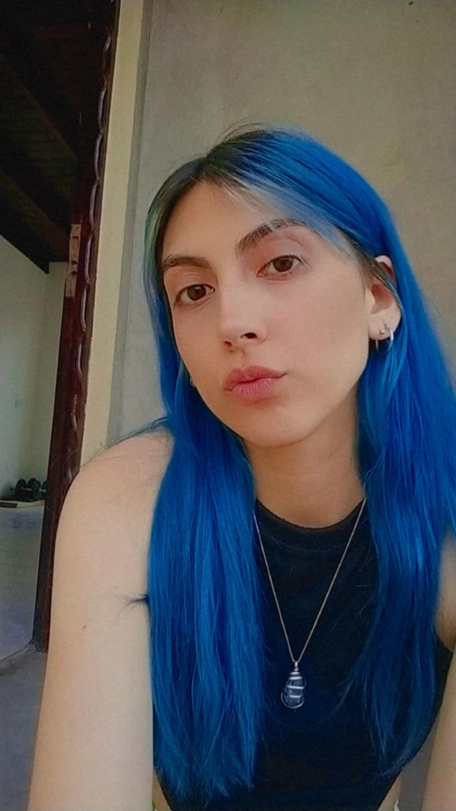

Estás a punto de leer una breve presentación personal de..
# Colonna Ailin

Tengo 23 años, durante la pandemia me había inscripto para cursar radiología en la UBA pero pasaron cosas y dejé (**fue culpa de la pandemia**). Así que decidí inscribirme a principios del 2021 a la carrera de informática acá, en la **UNAHUR**, una amiga me dio buenas referencias y así fue como hoy estoy escribiendo esto. 

Si bien ya me inscribí para cursar esta materia a principios del año pasado, por cuestiones personales y problemas de horarios decidí dejarla y darla en otro momento para darle más prioridad y poder disfrutarla ya que según dicen, todavía no lo pude comprobar, es una materia divertida que marca un antes y un después en la carrera.

No tengo más que decir que me siento muy motivada y con ganas de aprobar la materia este cuatrimestre para así poder continuar con las materias correlativas a ésta. Ya tengo ganas de poder desarrollar el juego final de la materia.

Dejo una foto mía por acá para que sepan quien soy en clases :)

